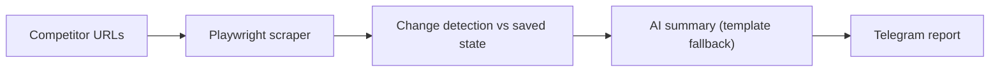

# Competitor Monitor Bot

**Scrapes competitor e-commerce pages daily, detects price, stock and product changes, and sends an Italian summary to Telegram.**

    



## Problem it solves

Checking competitor prices by hand every day does not scale. The bot does it on a schedule, keeps state to detect real changes, and delivers a short summary where the owner already reads messages.

**Monitoraggio automatico dei concorrenti e-commerce con report giornalieri in italiano via Telegram.**

Automatic competitor monitoring bot that scrapes up to 5 e-commerce URLs daily, detects changes, and delivers an Italian-language AI summary to a private Telegram channel.

---

## Funzionalità / Features

| Funzione | Dettaglio |
|---|---|
| Scraping async | Playwright Chromium headless, 30s timeout, selettori multipli di fallback |
| Rilevamento cambiamenti | Calo/aumento prezzi, esaurimento stock, rientro merce, nuovi prodotti, sconti |
| Riepilogo AI | GPT-4o-mini in italiano con emoji, fallback template automatico |
| Notifiche Telegram | Consegna al canale privato, split automatico messaggi >4096 caratteri |
| Stato persistente | File JSON con backup automatico in caso di corruzione |
| Modalità flessibile | `--once` per esecuzione singola, `--daemon` per ciclo schedulato |

---

## Requisiti / Requirements

- Python 3.10+
- Account OpenAI (chiave API / API key)
- Bot Telegram + canale privato
- ~200 MB disco per Playwright Chromium

---

## Installazione / Installation

```bash
# 1. Clone / download the project
cd competitor_monitor_bot

# 2. Create virtual environment
python -m venv .venv
source .venv/bin/activate        # Linux/macOS
# .venv\Scripts\activate         # Windows

# 3. Install dependencies
pip install -r requirements.txt

# 4. Install Playwright browser
playwright install chromium

# 5. Configure environment
cp .env.example .env
# Edit .env with your credentials
```

---

## Configurazione / Configuration

Copia `.env.example` in `.env` e compila tutti i campi:

```dotenv
TELEGRAM_BOT_TOKEN=123456:ABC-DEF...    # Token dal @BotFather
TELEGRAM_CHAT_ID=-1001234567890         # ID canale (negativo per canali)
OPENAI_API_KEY=sk-...                   # Chiave OpenAI
COMPETITOR_URLS=https://shop1.it/prodotto,https://shop2.it/categoria
STATE_FILE=state.json                   # File stato (default: state.json)
CHECK_INTERVAL_HOURS=24                 # Frequenza controllo in ore
PRICE_DROP_THRESHOLD=0.10               # Soglia calo prezzi (10% = alta severità)
```

### Come ottenere il TELEGRAM_CHAT_ID / How to get TELEGRAM_CHAT_ID

1. Aggiungi il bot al canale privato come amministratore
2. Invia un messaggio al canale
3. Apri: `https://api.telegram.org/bot<TOKEN>/getUpdates`
4. Trova `"chat":{"id": -100XXXXXXXXX}` nel JSON

---

## Utilizzo / Usage

```bash
# Singola esecuzione (cron-friendly)
python main.py --once

# Modalità daemon (gira in continuo)
python main.py --daemon

# Aiuto
python main.py --help
```

### Scheduling con cron (Linux/macOS)

```cron
# Ogni giorno alle 08:00
0 8 * * * /path/to/.venv/bin/python /path/to/main.py --once >> /var/log/competitor_bot.log 2>&1
```

### Systemd service (produzione)

```ini
[Unit]
Description=Competitor Monitor Bot
After=network.target

[Service]
Type=simple
WorkingDirectory=/path/to/competitor_monitor_bot
EnvironmentFile=/path/to/competitor_monitor_bot/.env
ExecStart=/path/to/.venv/bin/python main.py --daemon
Restart=on-failure
RestartSec=30

[Install]
WantedBy=multi-user.target
```

---

## Architettura / Architecture

```
main.py           ← Orchestratore (argparse, event loop, shutdown)
  ↓
config.py         ← Lettura .env, validazione
scraper.py        ← Playwright async → ProductSnapshot
comparator.py     ← old_state vs new_snapshots → [Change]
summarizer.py     ← GPT-4o-mini → testo italiano
notifier.py       ← python-telegram-bot → canale Telegram
state_manager.py  ← load/save JSON con backup
```

### Flusso dati / Data flow

```
URLs → scrape_all() → compare_snapshots() → save_state()
                                          → generate_summary()
                                          → send_report()
```

---

## Cambiamenti rilevati / Detected changes

| Tipo | Etichetta | Severità default |
|---|---|---|
| Calo prezzo (>10%) | `[CALO PREZZO]` | Alta |
| Calo prezzo (<10%) | `[CALO PREZZO]` | Media |
| Aumento prezzo | `[AUMENTO PREZZO]` | Bassa |
| Esaurimento stock | `[ESAURITO]` | Alta |
| Rientro merce | `[DISPONIBILE]` | Media |
| Nuovo prodotto | `[NUOVO]` | Media |
| Sconto aggiunto | `[SCONTO]` | Alta |
| Sconto rimosso | `[SCONTO RIMOSSO]` | Bassa |

---

## Pricing / Prezzi (esempio SaaS)

| Piano | Prezzo | URL monitorati | Frequenza |
|---|---|---|---|
| Starter | €49/mese | 2 | 1×/giorno |
| Business | €99/mese | 5 | 2×/giorno |
| Enterprise | €199/mese | 20 | Personalizzata |

---

## Note di sicurezza / Security notes

- Non committare mai il file `.env` nel repository
- Il file `.gitignore` dovrebbe escludere `.env` e `state.json`
- I token Telegram e OpenAI vanno ruotati periodicamente

---

## License

MIT

---

## Desktop App / Applicazione Desktop

### English
The **Competitor Monitor Bot** also includes a native desktop application built with **Flet** (Flutter-based Python UI). It works on **Windows, macOS, and Linux** with a modern dark interface.

#### Features
- Live dashboard with stats and scan history (4 KPI cards)
- Product table with search, status badges, and availability tracking
- URL management — add/remove competitor URLs visually
- Settings panel — configure Telegram, OpenAI, and scrape interval from the GUI
- One-click scan button with real-time results
- Italian interface (targeting Italian dropshippers)

#### Run the Desktop App
```bash
pip install -r requirements.txt
playwright install chromium
cp .env.example .env   # fill your credentials
python main_desktop.py
```

#### Build Standalone Executable
```bash
# Windows:
flet pack ui/app.py --name "CompetitorMonitor" --icon assets/icon.ico

# macOS:
flet pack ui/app.py --name "CompetitorMonitor" --icon assets/icon.icns

# Linux:
flet pack ui/app.py --name "CompetitorMonitor"
```
The standalone executable will be in the `dist/` folder — no Python installation needed.

### Italiano
**Competitor Monitor Bot** include anche un'applicazione desktop nativa costruita con **Flet** (UI Python basata su Flutter). Funziona su **Windows, macOS e Linux** con interfaccia scura moderna.

#### Avvio Desktop
```bash
pip install -r requirements.txt
playwright install chromium
cp .env.example .env   # inserisci le tue credenziali
python main_desktop.py
```

#### Pacchetto Standalone (senza Python)
```bash
flet pack ui/app.py --name "CompetitorMonitor"
```
Il file eseguibile sarà nella cartella `dist/`.

---

### Pricing / Prezzi
| Piano | Prezzo | Competitors |
|-------|--------|-------------|
| Starter | €49/mese | 1-2 URL |
| Professional | €99/mese | 3-5 URL |
| Agency | €199/mese | 5-10 URL + report giornaliero avanzato |
